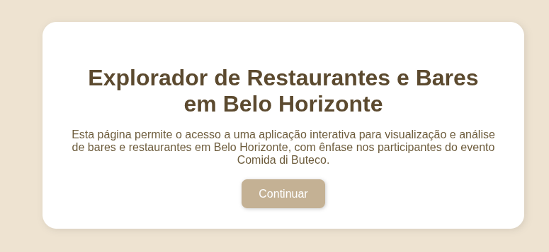
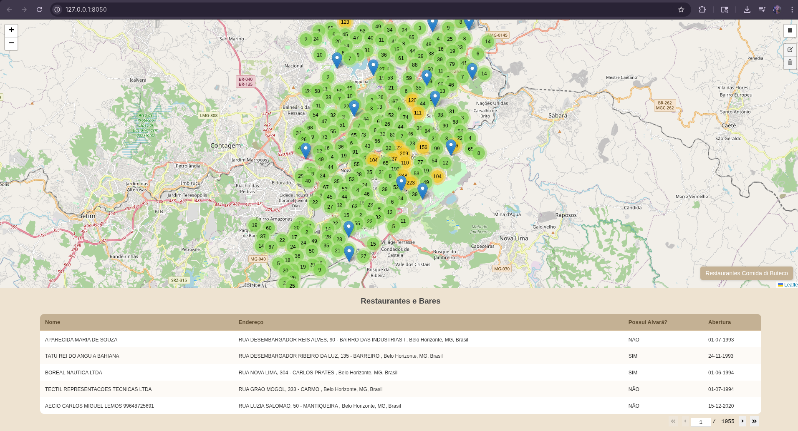
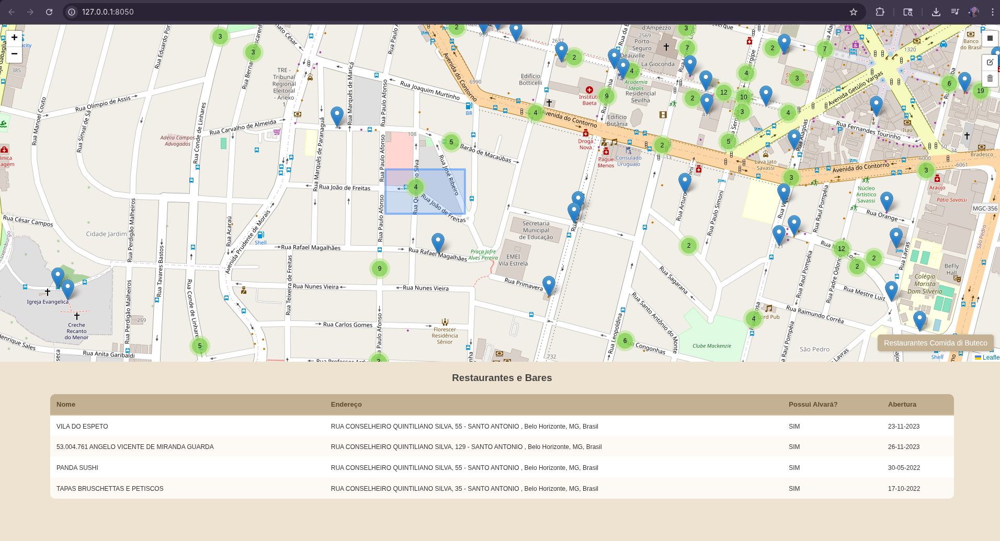
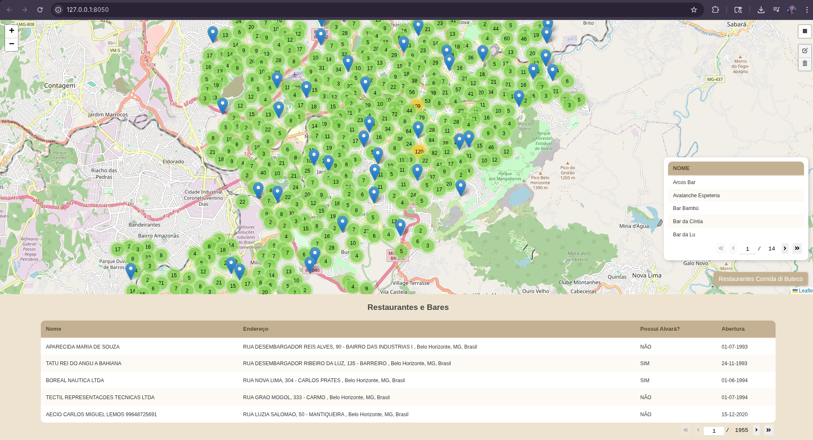
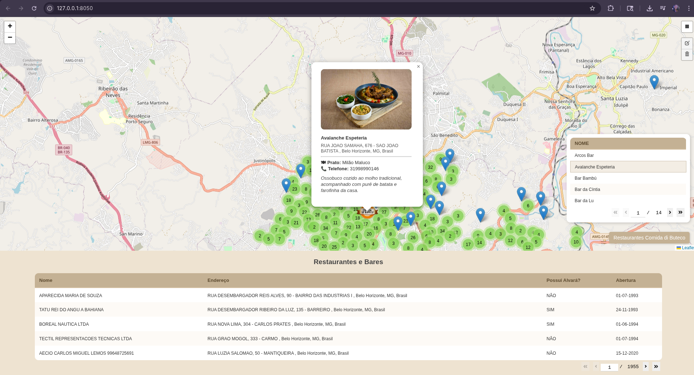
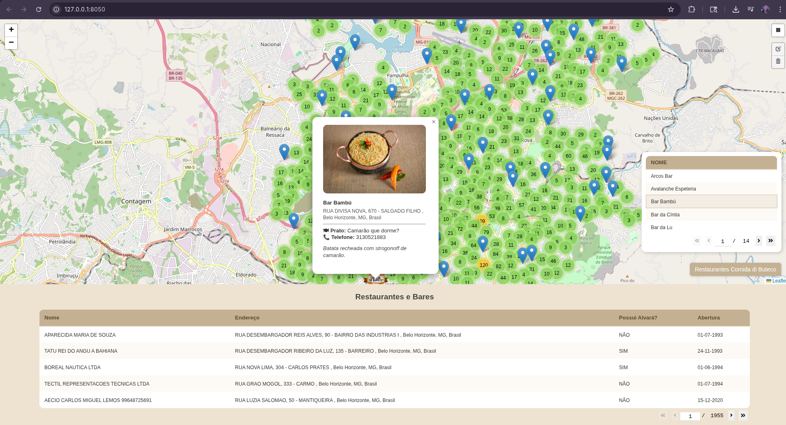

# 📍 Consulta Interativa de Estabelecimentos com KD-Tree e Dash Leaflet

Este projeto foi desenvolvido como parte do **Trabalho Prático 1 (TP1)** da disciplina **DCC207 – Algoritmos 2**, ministrada no Departamento de Ciência da Computação da **UFMG**.

> 🧑‍💻 Desenvolvido pelas alunas:  
> **Ester Sara Assis Silva**  
> **Julia Paes de Viterbo**

## 🎯 Objetivo

O sistema implementado realiza **consultas ortogonais sobre um conjunto de pontos geográficos** (bares e restaurantes da cidade de Belo Horizonte), com base em uma **estrutura de árvore k-dimensional (KD-Tree)**. O projeto visa não apenas fixar os conceitos de geometria computacional e estruturas de dados, mas também demonstrar a sua **aplicabilidade prática** por meio de uma interface interativa com mapas.

<p align="center">
  
    <br>
  <em>Figura 1 – Tela inicial do Dash</em>
</p>

## ⚙️ Funcionalidades

- Visualização geográfica dos estabelecimentos usando `dash-leaflet`.
- Seleção de área com ferramenta retangular diretamente no mapa.
- Busca eficiente com KD-Tree para retornar os pontos dentro da área selecionada.
- Tabela com dados filtrados automaticamente.
- Restrições interativas: apenas um retângulo pode ser desenhado por vez.
- Pré-processamento dos dados brutos da PBH com geocodificação e filtragem por CNAE.

<p align="center">
  
    <br>
  <em>Figura 2 – Tela principal do Dash</em>
</p>

<p align="center">
  
    <br>
  <em>Figura 3 – Funcionalidade de seleção</em>
</p>


### 🍽️ Funcionalidades Adicionais — Comida di Buteco
Como extensão opcional, o sistema foi integrado com uma segunda base de dados (obtida por um web scraping na página oficial) contendo informações de estabelecimentos participantes do evento Comida di Buteco. As seguintes funcionalidades foram adicionadas:
- Tabela com nomes dos restaurantes participantes do evento que aparece ao selecionar o botão "Restaurantes Comida di Buteco".
- Ao selecionar um dos restaurantes na tabela, um marcador personalizado o identifica no mapa e, ao clicar no mesmo, uma descrição do prato participante e informações do restaurante aparecem em um popup.

<p align="center">
  
    <br>
  <em>Figura 4 – Tabela flutuante Comida di Buteco</em>
</p>
<p align="center">
  
    <br>
  <em>Figura 5 – Marcador personalizado Comida di Buteco</em>
</p>
<p align="center">
  
    <br>
  <em>Figura 6 – Popup personalizado Comida di Buteco 1</em>
</p>
<p align="center">
  
    <br>
  <em>Figura 7 – Popup personalizado Comida di Buteco 2</em>
</p>

## 🚀 Como Executar

### Instale as dependências

```bash
make install
```
### Rode o servidor
```bash
make run
```
### Rode os testes
```bash
make testes
```
> Observação: Caso você queira utilizar uma base mais recente de atividades econômicas, basta alterar o link no arquivo notebooks/data_processing.ipynb e executa-lo passo a passo.

## 📊 Fonte dos Dados
Os dados foram extraídos do portal de dados abertos da Prefeitura de Belo Horizonte:

🔗 https://dados.pbh.gov.br/dataset/atividades-economicas1

Filtramos apenas estabelecimentos cuja descrição da CNAE contenha termos relacionados a "bar" ou "restaurante", e os endereços foram geocodificados usando a API do OpenStreetMap.

Para aplicação extra referente ao evento "Comida di Buteco", os dados foram gerados com um web scraping realziado na página

🔗 https://comidadibuteco.com.br/

## 📄 Licença
Este projeto é de uso acadêmico e segue a política de plágio da disciplina. Qualquer reutilização deve ser referenciada adequadamente.
